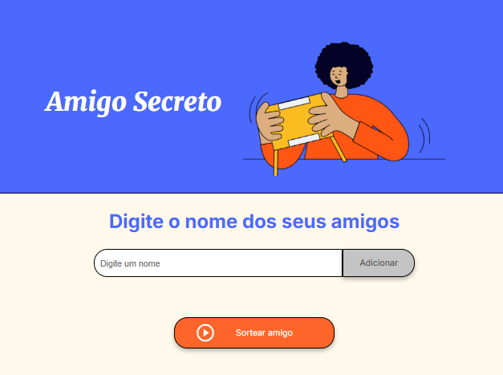

<h1 align="center"> Sorteio do Amigo Secreto </h1>


<div>
<h2> Sobre</h2>
<p>Projeto utilizado nos cursos de lógica de programação da ONE - #oraclenexteducation! #aluralatam.</p>

<p>O desafio "Amigo Secreto" tem como objetivo criar um programa que simule a troca de presentes entre amigos. Cada participante será sorteado para dar um presente a outro, garantindo que ninguém receba um presente de si mesmo.</p>
</div>

## Tecnologias
<div>
  
  
  
</div>


## Funcionalidades
- Cadastro de participantes
- Sorteio aleatório dos amigos secretos
- Exibição dos resultados do sorteio

## Como Executar o Projeto
1. Clone este repositório:
   ```bash
   git clone https://github.com/eladevonario/amigo-secreto.git
2. Navegue até o diretório do projeto:
   bash
   cd amigo-secret
3. Abra o arquivo index.html em seu navegador.


## Estrutura do Projeto
   amigo-secreto/
│
├── index.html      # Página principal do projeto
├── style.css       # Estilos do projeto
└── script.js       # Lógica do sorteio

## Contribuições
Sinta-se à vontade para contribuir com melhorias e novas funcionalidades. Para isso, siga os passos abaixo:

## Faça um fork deste repositório.
1. Crie uma nova branch:
    css
    git checkout -b minha-contribuicao
2. Faça suas alterações e commit:
    sql
    git commit -m "Descrição da minha contribuição"
3. Envie para o repositório remoto:
    perl
    git push origin minha-contribuicao
    Abra um Pull Request.

## Licença
Este projeto está sob a licença MIT. Veja o arquivo LICENSE para mais detalhes.

## Contato
Para dúvidas ou sugestões, entre em contato pelo e-mail: eladevon@gmail.com
Sinta-se à vontade para personalizar o conteúdo conforme necessário! Se precisar de mais alguma coisa, estou aqui para ajudar. 😊